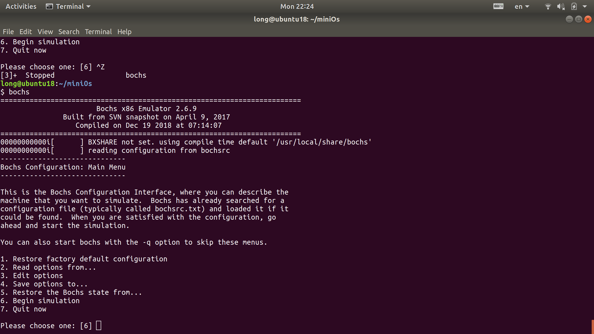
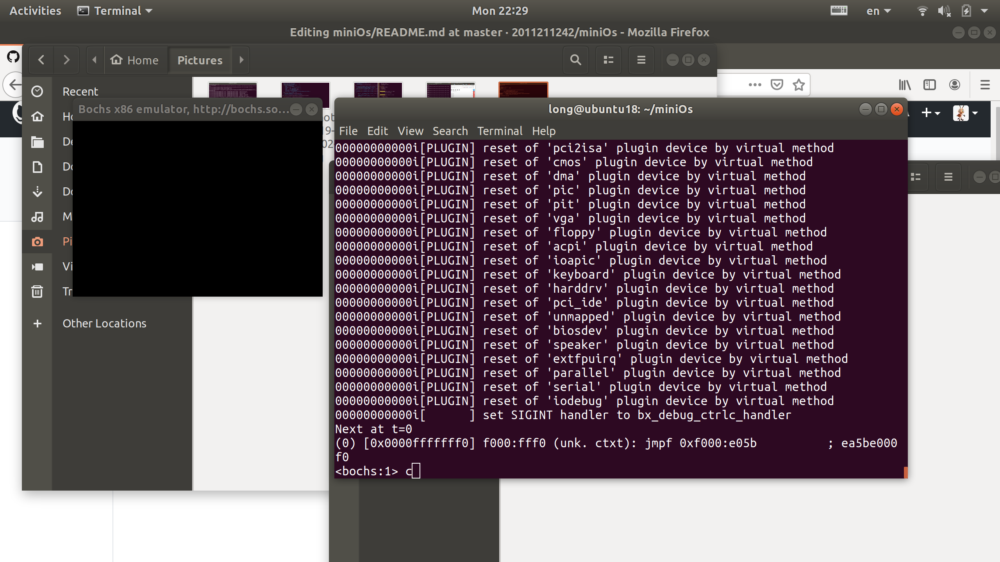
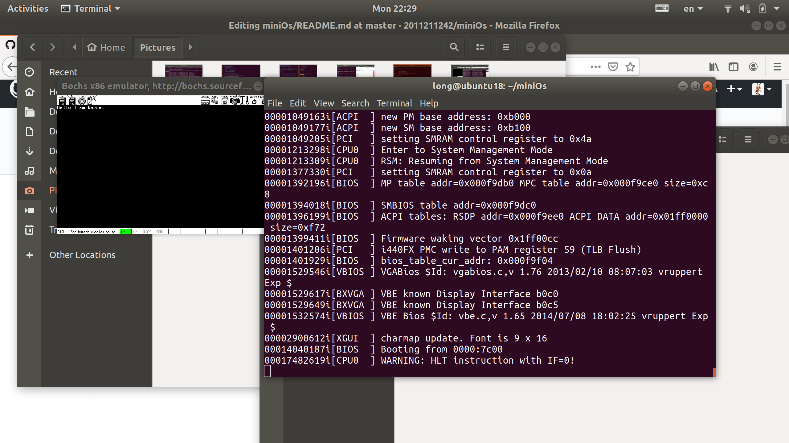
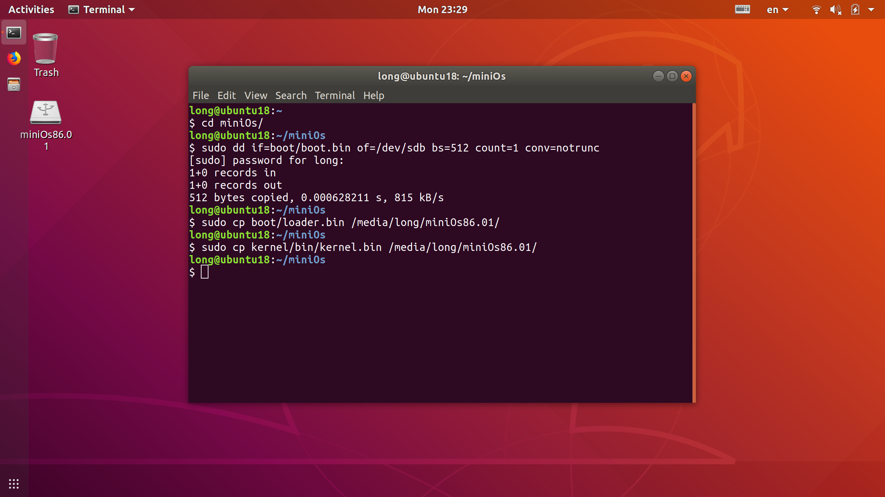

# miniOs
develop a mini x86 system 

说一下我的运行环境： linux 系统（非虚拟机）+ bochs模拟器，bochs模拟器安装教程如下
https://blog.csdn.net/kuang_tian_you/article/details/81412364

安装成功后： 
  
	1、 git clone 本项目
  
	2、 在目录下执行 bochs 
   
    3、选择默认值6，直接按下enter
   
    4、输入c，直接按下enter; 运行效果如下
   

    U盘启动盘的制作
    注意：执行下面的命令会格式化U盘，请确认U盘中信息已备份
   

    1、在miniOs目录下执行
    sudo dd if=boot/boot.bin of=/dev/sdb bs=512 count=1 conv=notrunc

    2、将U盘拔出再重新插入执行下面的命令(自行替换username)
    sudo cp boot/loader.bin /media/username/miniOs86.01/
    sudo cp kernel/bin/kernel.bin /media/username/miniOs86.01/

    3、修改bios启动顺序，将u盘启动设置优先级最高
    执行结果如下：
   

